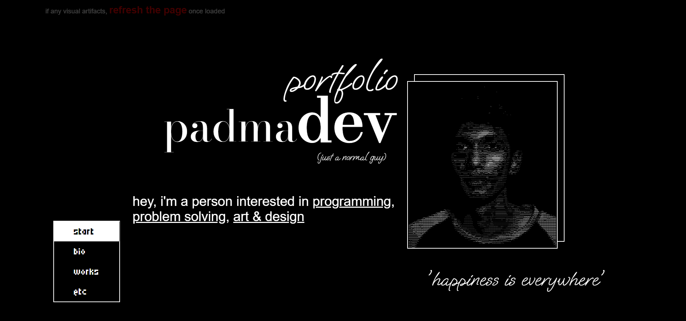

# Web Portfolio

A dynamic and interactive personal portfolio website featuring smooth scroll-based animations and modern UI effects. The page responds to user scrolling with animated transitions and section changes to create an engaging experience.

---

## Live Demo
[View Portfolio](https://padmadevd.github.io/web_portfolio/)  

---

## Tech Stack

- **HTML5** – Structure and semantic layout  
- **CSS3** – Styling, layout, and responsiveness  
- **JavaScript (ES6)** – Core logic and interactions  
- **jQuery** – DOM manipulation and event handling  
- **Anime.js** – Smooth, high-performance animations  

---

## Features

- Scroll-based dynamic animations
- Smooth transitions between sections
- Interactive UI elements
- Responsive design for different screen sizes
- Lightweight and fast performance

---
